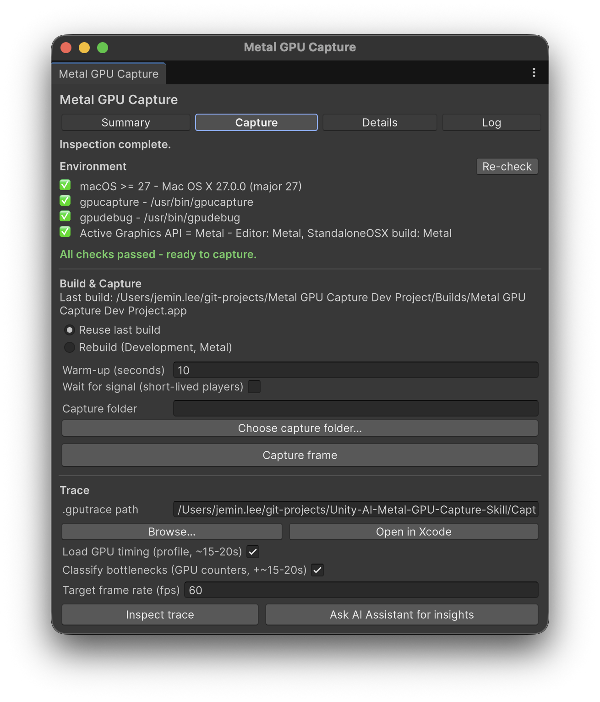

# Metal GPU Capture Skill — for Unity on macOS

A Unity (UPM) package that captures a **Metal GPU frame** from a macOS Standalone build and
interprets it in **URP project context** — driven entirely from the Editor via Apple's
**macOS 27 `gpucapture` / `gpudebug`** CLIs (no Xcode required). Two entry points share one core:

- **A) A dockable Editor window** (`Window > Analysis > Metal GPU Capture`) — build/capture, then see
  real GPU frame time, a frame-budget gauge, a per-category breakdown, the **Top 3 optimization
  insights**, and per-pass **GPU bottleneck** classification.
- **B) Unity AI Assistant skills + `[McpTool]` tools** — so the in-Editor Assistant can capture and
  interpret traces directly, or you can hand it the current data with one button.


*Summary tab on an Apple M3 Pro URP capture: 31.10 ms GPU frame, over the 60 fps budget, with the Top 3
insights.*

## Requirements

- **macOS 27** with `gpucapture` and `gpudebug` at `/usr/bin` (verified on macOS 27.0).
- For **GPU timing/bottlenecks**: an embedded profiling session in the trace, or an **Apple M3 / A17+**
  GPU to run profiling (`gpudebug profile run`).
- **Unity 6** (`6000.0`+).
- **`com.unity.ai.assistant`** in the host project (provides the Assistant + the `[McpTool]` registry).

## Install (local package)

This repo *is* a UPM package. Add it to a Unity 6 project via the host `Packages/manifest.json`:

```jsonc
{
  "dependencies": {
    "com.jeminlee.metal-gpu-capture-skill": "file:/absolute/path/to/Unity-AI-Metal-GPU-Capture-Skill"
  }
}
```

…or `Window > Package Manager > + > Add package from disk…` and pick this folder's `package.json`.
Enable the skills under `Project Settings / Preferences > AI > Skills` (they are deny-by-default).

## Usage

### The window
Open **`Window > Analysis > Metal GPU Capture`**. It has four tabs; the status line stays visible across
all of them, and the window jumps to **Summary** after a capture/inspect.

- **Capture** — run a capture or point at an existing trace:
  - *Environment* — checks macOS ≥ 27, `gpucapture`/`gpudebug` on PATH, and that Metal is the active API.
  - *Build & Capture* — Reuse the last macOS Standalone build or Rebuild a Development/Metal one, set a
    warm-up, choose the **Capture folder** (where `.gputrace` files are saved; blank = the package's
    `Captures/`), then **Capture frame**.
  - *Trace* — the **`.gputrace` path** (remembered between sessions), **Browse…** (file/folder picker),
    **Open in Xcode** (opens the trace in Xcode's Metal debugger — convenience only), the
    **Load GPU timing** and **Classify bottlenecks** toggles, the **Target frame rate**, and the
    **Inspect trace** / **Ask AI Assistant for insights** actions.
- **Summary** — Device, encoders/draws, **GPU frame time**, the **frame-budget gauge** vs your target
  FPS, the top pass's **bottleneck**, and the **Top 3 insights** (each: what, measured evidence,
  URP-specific fix, and a *quick win* tag).
- **Details** — CPU/GPU frame time, counts, **GPU time by category**, and the **top GPU passes** with
  their per-pass bottleneck (e.g. `↳ Fragment-shader-launch bound [Fragment Shader Launch 91%, …]`).
- **Log** — verbose `gpucapture` / `gpudebug` output.

**Capture tab** — environment checks, build/capture, capture folder, and trace input + actions:



**Details tab** — GPU time by category and the top GPU passes with their per-pass bottleneck:


**Log tab** — the `gpucapture` / `gpudebug` commands that ran:


> Loading GPU timing runs `gpudebug profile load` (~15–20 s); classifying bottlenecks adds another
> ~15–20 s. Turn either off for a fast structural inspect (counts + passes only). Settings (last
> trace, capture folder, target FPS, toggles) persist via `EditorPrefs`.

### With the AI Assistant
Ask the Assistant to "capture a Metal frame and analyze it", or click **Ask AI Assistant for insights**
on a captured trace — it hands the Assistant the measured summary (GPU frame time + top passes) and runs
the `interpret-gpu-trace` skill. The same five tools power both the window and the Assistant.

## How it works

- `gpucapture` attaches to the player (launched with `MTL_CAPTURE_ENABLED=1`) and writes a `.gputrace`
  (single-frame boundary capture, with a `--until-exit` + `stop` fallback).
- `gpudebug -t <trace> --json` inspects it. **GPU timing requires `profile load`** — once loaded,
  `performance/timeline` gives the whole-frame GPU time and `performance/encoders` gives per-pass cost.
- **Bottlenecks** come from each top encoder's `info --all` performance *limiters* (e.g. Fragment Shader
  Launch / Instruction Throughput / Texture / bandwidth), mapped to a plain-language verdict + fix.
- **CPU frame time is *not* in a GPU trace** — use Unity's `FrameTimingManager` / ProfilerRecorder for CPU.
- Insights are **deterministic** (computed from measured pass costs, no LLM); the Assistant adds
  explanation and answers follow-ups on top.

## Custom tools (`Unity.AI.MCP.Editor.ToolRegistry`)

| Tool id                         | Purpose |
|---------------------------------|---------|
| `Metal.CheckCaptureEnvironment` | Preflight: macOS version, `gpucapture`/`gpudebug` on PATH, Metal active. |
| `Metal.FindExistingBuild`       | Locate the last macOS Standalone build. |
| `Metal.BuildStandalonePlayer`   | Build a capture-enabled macOS Development Build (Metal). |
| `Metal.CaptureStandalonePlayer` | Launch with `MTL_CAPTURE_ENABLED=1`, warm up, capture a `.gputrace`. |
| `Metal.InspectTrace`            | Inspect a `.gputrace` (`loadGpuTiming`, `classifyBottlenecks` options) → summary. |

## Version control

Two separate repositories: the **host project** uses **Unity Version Control** and only *references*
this package via a local `file:` path; **this package** lives in its **own Git/GitHub repo**. Edits the
Assistant makes under `Packages/com.jeminlee.metal-gpu-capture-skill/` are versioned **here**.

## Package layout

```
.
├── package.json
├── Editor/
│   ├── *.asmdef                       # Editor assembly (refs Unity.AI.MCP.Editor + Assistant.API.Editor)
│   ├── Core/                          # shared core: env / build / capture / inspect / insights
│   ├── Window/MetalGpuCaptureWindow.cs
│   ├── Model/MetalTraceSummary.cs
│   └── MetalGpuCaptureTools.cs        # the five [McpTool] wrappers
├── AIAssistantSkills/                # capture-metal-frame, interpret-gpu-trace (SKILL.md)
└── Documentation~/                   # docs + images (the ~ keeps it out of Unity's importer)
```

## References

- Apple **Game Porting Toolkit 4** Claude Code marketplace (`game-porting-skills`): `using-gpucapture`,
  `using-gpudebug`, `debugging-rendering-issues`.
- Unity AI Assistant docs (`com.unity.ai.assistant`).
