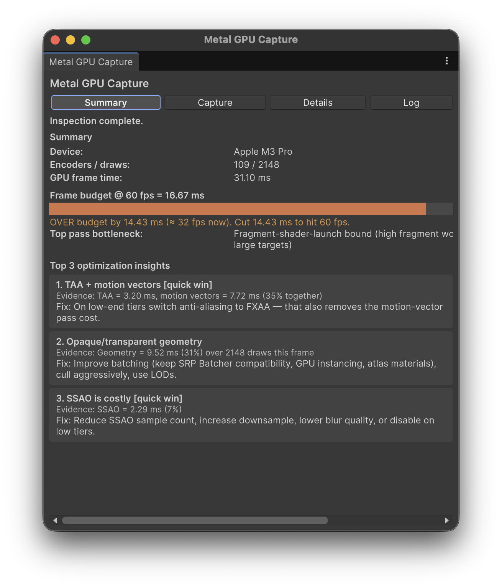
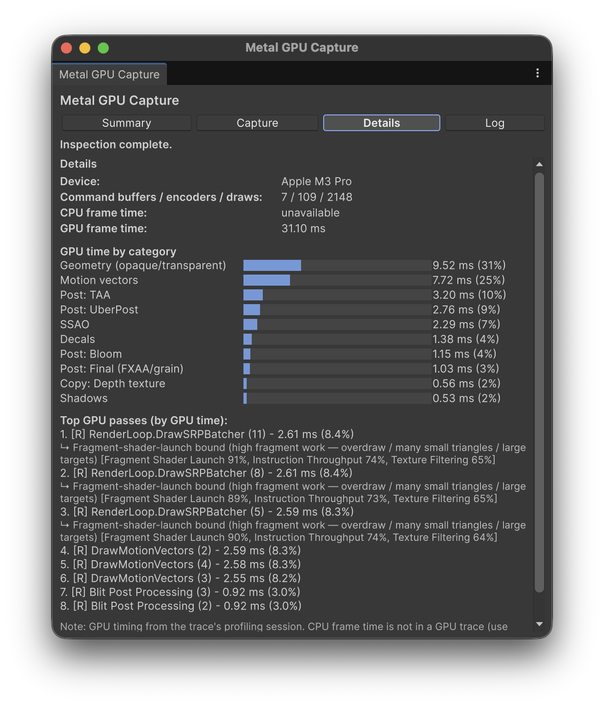
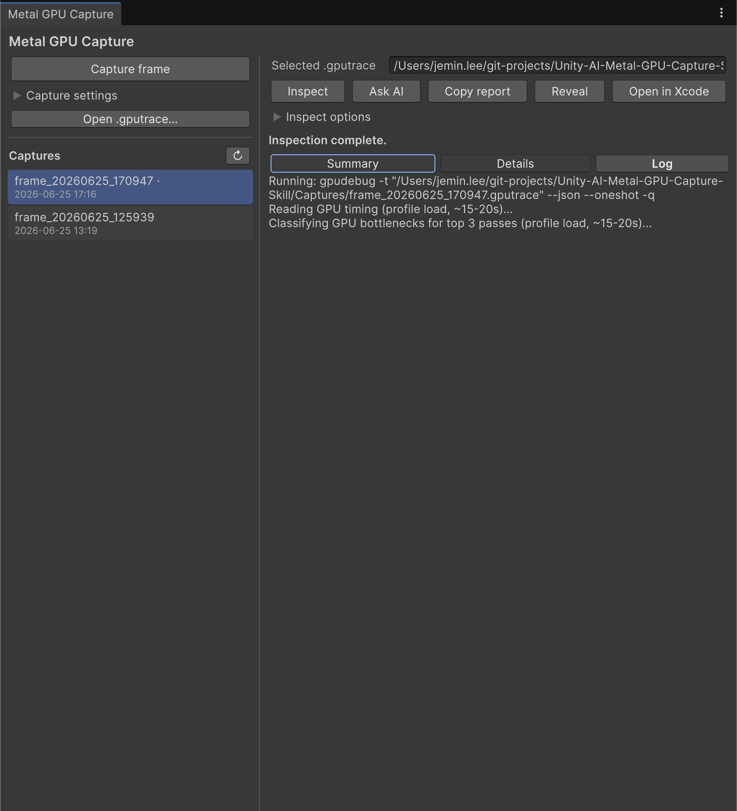
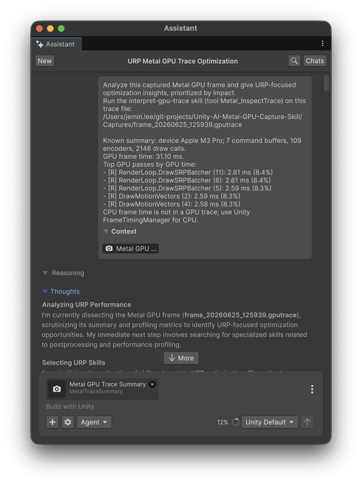

# Metal GPU Capture Skill — for Unity on macOS

A Unity (UPM) package that captures a **Metal GPU frame** from a macOS Standalone build and
interprets it in **URP project context** — driven entirely from the Editor via Apple's
**macOS 27 `gpucapture` / `gpudebug`** CLIs (no Xcode required). Two entry points share one core:

- **A) A dockable Editor window** (`Window > Analysis > Metal GPU Capture`) — build/capture, then see
  real GPU frame time, a frame-budget gauge, a per-category breakdown, the **Top 3 optimization
  insights**, and per-pass **GPU bottleneck** classification.
- **B) Unity AI Assistant skills + `[McpTool]` tools** — so the in-Editor Assistant can capture and
  interpret traces directly, or you can hand it the current data with one button.



*Summary tab on an Apple M3 Pro URP capture: 31.10 ms GPU frame, over the 60 fps budget, with the Top 3
insights.*

## Requirements

- **macOS 27** with `gpucapture` and `gpudebug` at `/usr/bin` (verified on macOS 27.0).
- For **GPU timing/bottlenecks**: an embedded profiling session in the trace, or an **Apple M3 / A17+**
  GPU to run profiling (`gpudebug profile run`).
- **Unity 6** (`6000.0`+).
- **`com.unity.ai.assistant`** in the host project (provides the Assistant + the `[McpTool]` registry).

## Install (local package)

This repo *is* a UPM package. Add it to a Unity 6 project via the host `Packages/manifest.json`:

```jsonc
{
  "dependencies": {
    "com.jeminlee.metal-gpu-capture-skill": "file:/absolute/path/to/Unity-AI-Metal-GPU-Capture-Skill"
  }
}
```

…or `Window > Package Manager > + > Add package from disk…` and pick this folder's `package.json`.
Enable the skills under `Project Settings / Preferences > AI > Skills` (they are deny-by-default).

## Usage

### The window
Open **`Window > Analysis > Metal GPU Capture`**. The layout mirrors Unity's Memory Profiler — a
**left sidebar** to capture and list traces, and a **main area** with per-trace tabs.

**Left sidebar**
- **Capture frame** — the global capture action. The **Capture settings** foldout holds the
  environment checks (macOS ≥ 27, `gpucapture`/`gpudebug`, Metal active), Reuse-vs-Rebuild, warm-up,
  Wait-for-signal, and the **Capture folder** (blank = `<Project>/MetalGpuCaptures`).
- **Open .gputrace…** — inspect an existing trace from anywhere.
- **Captures** — the `.gputrace` files in the capture folder (newest first; a `·` marks ones already
  inspected). Click to select, double-click to inspect.

**Main area** (acts on the selected trace)
- Actions: **Inspect**, **Ask AI**, **Copy report**, **Reveal**, **Open in Xcode**; an **Inspect
  options** foldout (Load GPU timing, Classify bottlenecks, Target frame rate). A status line with an
  elapsed timer and a **Cancel** button sits above the tabs.
- **Summary** tab — Device, encoders/draws, **GPU frame time**, the **frame-budget gauge** vs your
  target FPS, the top pass's **bottleneck**, and the **Top 3 insights**.
- **Details** tab — counts, **GPU time by category**, and the **top GPU passes** with their per-pass
  bottleneck (e.g. `↳ Fragment-shader-launch bound [Fragment Shader Launch 91%, …]`).
- **Log** tab — verbose `gpucapture` / `gpudebug` output.

Selecting a different capture loads its **cached** inspection (or prompts you to Inspect it); the
results, active tab, and cache survive Editor recompiles.





> Loading GPU timing runs `gpudebug profile load` (and `profile run --embed` for fresh captures);
> classifying bottlenecks adds another pass. Turn either off (Inspect options) for a fast structural
> inspect. Settings persist via `EditorPrefs`. Screenshots are regenerated via
> `Tools > Metal GPU Capture > Generate Doc Screenshots`.

### With the AI Assistant
Ask the Assistant to "capture a Metal frame and analyze it", or click **Ask AI Assistant for insights**
on a captured trace — it hands the Assistant the measured summary (GPU frame time + top passes) and runs
the `interpret-gpu-trace` skill. The same five tools power both the window and the Assistant.



*The button sends a prefilled prompt plus the captured **Metal GPU Trace Summary** as attached context;
the Assistant then selects and runs the `interpret-gpu-trace` skill.*

## How it works

- `gpucapture` attaches to the player (launched with `MTL_CAPTURE_ENABLED=1`) and writes a `.gputrace`
  (single-frame boundary capture, with a `--until-exit` + `stop` fallback).
- `gpudebug -t <trace> --json` inspects it. **GPU timing requires `profile load`** — once loaded,
  `performance/timeline` gives the whole-frame GPU time and `performance/encoders` gives per-pass cost.
- **Bottlenecks** come from each top encoder's `info --all` performance *limiters* (e.g. Fragment Shader
  Launch / Instruction Throughput / Texture / bandwidth), mapped to a plain-language verdict + fix.
- **CPU frame time is *not* in a GPU trace** — use Unity's `FrameTimingManager` / ProfilerRecorder for CPU.
- Insights are **deterministic** (computed from measured pass costs, no LLM); the Assistant adds
  explanation and answers follow-ups on top.

## Custom tools (`Unity.AI.MCP.Editor.ToolRegistry`)

| Tool id                         | Purpose |
|---------------------------------|---------|
| `Metal.CheckCaptureEnvironment` | Preflight: macOS version, `gpucapture`/`gpudebug` on PATH, Metal active. |
| `Metal.FindExistingBuild`       | Locate the last macOS Standalone build. |
| `Metal.BuildStandalonePlayer`   | Build a capture-enabled macOS Development Build (Metal). |
| `Metal.CaptureStandalonePlayer` | Launch with `MTL_CAPTURE_ENABLED=1`, warm up, capture a `.gputrace`. |
| `Metal.InspectTrace`            | Inspect a `.gputrace` (`loadGpuTiming`, `classifyBottlenecks` options) → summary. |

## Version control

Two separate repositories: the **host project** uses **Unity Version Control** and only *references*
this package via a local `file:` path; **this package** lives in its **own Git/GitHub repo**. Edits the
Assistant makes under `Packages/com.jeminlee.metal-gpu-capture-skill/` are versioned **here**.

## Package layout

```
.
├── package.json
├── Editor/
│   ├── *.asmdef                       # Editor assembly (refs Unity.AI.MCP.Editor + Assistant.API.Editor)
│   ├── Core/                          # shared core: env / build / capture / inspect / insights
│   ├── Window/MetalGpuCaptureWindow.cs
│   ├── Model/MetalTraceSummary.cs
│   └── MetalGpuCaptureTools.cs        # the five [McpTool] wrappers
├── AIAssistantSkills/                # capture-metal-frame, interpret-gpu-trace (SKILL.md)
└── Documentation~/                   # docs + images (the ~ keeps it out of Unity's importer)
```

## References

- Apple **Game Porting Toolkit 4** Claude Code marketplace (`game-porting-skills`): `using-gpucapture`,
  `using-gpudebug`, `debugging-rendering-issues`.
- Unity AI Assistant docs (`com.unity.ai.assistant`).
